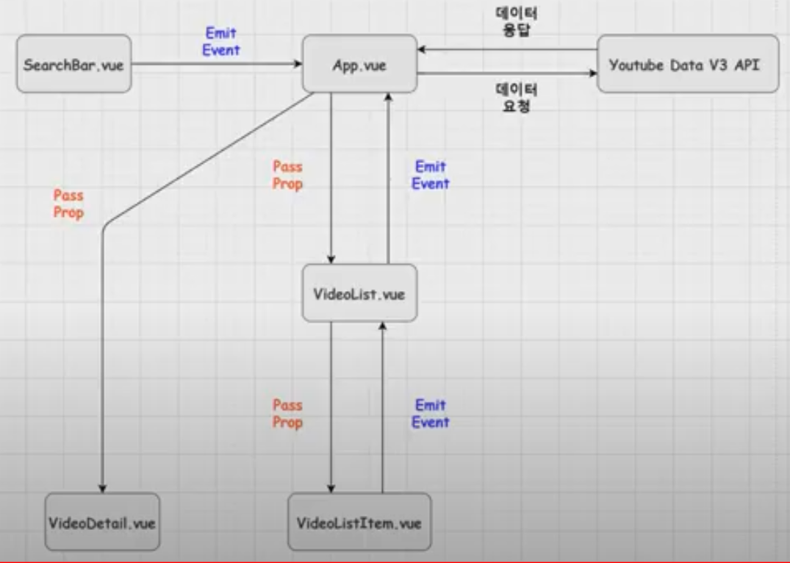

# README


### 1. 프로젝트명

---

VueTube 

### 2. 애플리케이션 한 줄 소개

---

- Vue 이용한 Youtube 기능 구현 
- Youtube Api 및 Vue Cli를 활용

---

### 3. 데모 스크린샷


​																[데모 스크린 샷]

### 4. 주요 기능들

- 검색어에 따른 썸네일 | 타이틀 | 내용 출력   
- 비디오 영상을 누르면 영상 출력



​																			[ 웹 설계 구조 ]

- prop 과 Emit을 통한 데이터 전달

  - App.vue

    ```Vue
    <script>
    import SearchBar from '@/components/SearchBar'
    import VideoList from '@/components/VideoList'
    import VideoListItemDetail from '@/components/VideoListItemDetail'
    
    export default {
      name: 'App',
      components: {
        SearchBar,
        VideoList,
        VideoListItemDetail,
      },
      data() {
        return {
          videoList: [],
          selectedVideo: {},
          isVideoSelected: false,
        }
      },
      methods: {
        selectedVideos(videoList) {
          this.videoList = videoList
        },
        selectVideo(video) {
          this.selectedVideo = video
          this.isVideoSelected = true
        }
      }
    }
    </script>
    ```

  - VideoList.vue

    ```javascript
    <VideoListItem 
    	...
    // 왼쪽의 video는 자식 컴포넌트인 VideoListItem에서 사용 할 이름
    // 오른쪽의 video는 부모 컴포넌트인 VideoList에 있는 video 데이터
        :video="video"
    />
    ```

  - VideoListItem.vue

    ```javascript
    export default {
      name: 'VideoListItem', 
      // 부모 컴포넌트(VideoList)로부터 내려온 데이터(video라는 이름으로 내려줌)를 받아서 활용한다.
      props: {
        video: Object,
      },
      ...
    ```

    


### 5.프로젝트 설정 및 실행 방법 

- npm install -> package 설치

- youtube api 발급을 통한 기능 제공

  ```javascript
  import axios from 'axios'
  
  const BASE_URL = 'https://www.googleapis.com/youtube/v3/search'
  const API_KEY = process.env.VUE_APP_YOUTUBE_API_KEY
  
  export default {
    name: 'SearchBar',
    data() {
      return {
        userInput: '',
      }
    },
    methods: {
      fetchVideos(event) {
        this.userInput = event.target.value
  
        const config = {
          // 객체로 바깥을 한번더 감싼 이유는 params이외에 다른 속성도 있기때문
          params: {
            part: 'snippet',
            key: API_KEY,
            q: this.userInput,
          },
        }
        	......
  ```

  

### 6. 느낀점, 문제점과 해결방법 & 인사이트

- 어떠한 순서로 데이터가 흘러가는지 고민하며 코드를 작성하면 props와 emit을 공부해나갔다.
- 흐름을 이해하기 위해 번호를 붙여가며 코드를 작성하였고 많은 도움이 되는 방법이었다.
- 데이터 규모가 작은 웹 어플리케이션을 개발하는 경우에는 data관리가 어렵지 않지만 규모가 커졌을 때를 생각하니 `단방향으로 내려가는 바인딩` 의 중요성을 느낄 수 있었다.

